<div align="center">


# Vaibhav Rawat

### Software Developer · Backend Developer · CS Student

Building backend systems, learning how things work under the hood,  
and solving problems one commit at a time.

[GitHub](https://github.com/vaibhavrawat0701)

</div>

<br>


I'm **Vaibhav Rawat**, a Computer Science student and software developer focused on backend development, databases, APIs, and problem solving.

I like understanding the internals behind the tools I use — from how REST APIs communicate with applications to how databases, authentication, routing, and backend architectures fit together.

I'm currently strengthening my knowledge of **Data Structures & Algorithms** while building backend and full-stack projects.

My current learning path includes **Node.js, Express.js, MongoDB, PostgreSQL, Java, Python, Django and Django REST Framework**.

<br>


```text
languages     JavaScript · Java · Python · SQL

backend       Node.js · Express.js · Django · Django REST Framework

databases     MongoDB · PostgreSQL

frontend      React · HTML · CSS

apis          REST APIs · GitHub API

tools         Git · GitHub · VS Code · Postman

currently     DSA · Backend Development · Django · DRF · PostgreSQL
```

<br>


### V-TUBE — YouTube Backend

A YouTube-style backend project built while learning production-oriented backend development.

The project explores concepts including authentication, users, videos, comments, playlists, subscriptions, likes, file uploads and API development.

`Node.js` `Express.js` `MongoDB` `Mongoose` `JWT` `Cloudinary`

[View repository →](https://github.com/vaibhavrawat0701/V-TUBE-youtube-s-clone-)

---

### Instagram Clone

An Instagram-inspired project built to explore the architecture and features behind a social-media application.

[View repository →](https://github.com/vaibhavrawat0701/instagram-clone)

---

### DSA

My Data Structures and Algorithms learning and practice repository.

I use this repository to implement concepts, solve problems and document my progress while learning DSA.

`Java` `Arrays` `Linked Lists` `Stacks` `Queues` `Recursion` `Algorithms`

[View repository →](https://github.com/vaibhavrawat0701/DSA)

---

### PostgreSQL

My PostgreSQL and SQL learning repository.

Contains exercises and examples covering queries, filtering, joins, aggregate functions, subqueries, relationships and database fundamentals.

`PostgreSQL` `SQL`

[View repository →](https://github.com/vaibhavrawat0701/PostgreSQL)

---

### Backend Development

Backend development experiments and learning material as I explore server-side development and API architecture.

[View repository →](https://github.com/vaibhavrawat0701/backend-development)

<br>




<br>


